# High-dynamic-range Imaging

The script combines multiple images taken from the same location but with different shutter speed into one HDR image. 

## Method

1. alignment

Slight misalignment in the images will cause the algorithm to perform much worse since it assumes a fixed point in different images would have the same real-world irradiance. We use `cv2.createAlignMTB` to automatically align the images, independent of exposure. We assume that the shift is less than 3 pixels (`max_bits=2`).

2. calculating the radiance map

To figure out the radiance, we follow _Debevec and Malik 1997_. Assuming an image is taken with shutter speed `t`, we solve for a exposure response function `g` such that a pixel value `z` conforms to that `g(z) = log(e) + log(t)`, where `e` is the real-world radiance at that pixel. [1]

Since cameras are usually more lossy at extreme exposures, we use a trapezoid weight function to penalize the pixels where it's too bright or too dark during the sampling process. We sample 500 points from each image. 

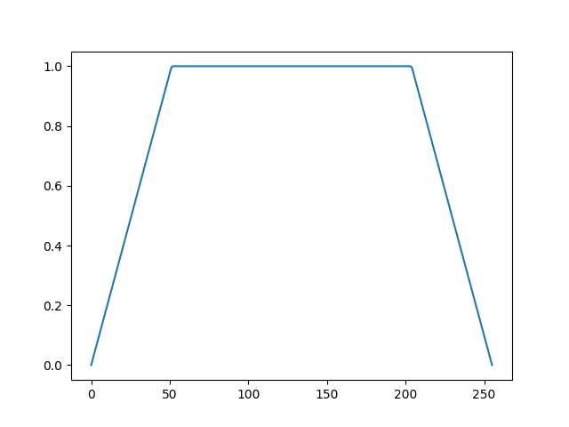

We apply the algorithm on each of the three channels. We also tried to experiment on other color space such as HSV or L\*a\*b\*. However, due to the compression of JPEG, the hue channel in HSV usually have noticeable blocky artifacts when the environment is dark. This causes the result to have some over-saturated spots even if we intensely penalize the dark areas. We do not use L\*a\*b\* since it only have 100 lightness values compared to the usual 256. 

Below are some results with HSV color space. Note the over-saturated artifacts.

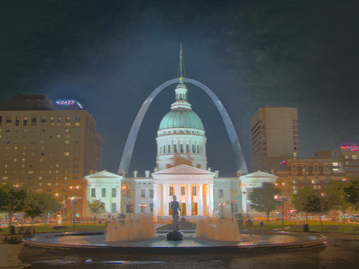

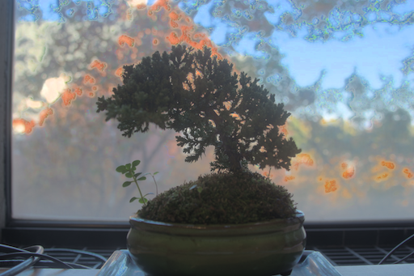

3. Tone Mapping

To show the image with a high-dynamic-range, we follow _Durand 2002_. We use a bilateral filter to filter out the low frequencies, and offset and scale the low frequencies. Then we put back the high frequencies and the colors. [2] We use a bilateral filter with diameter of 3 and sigma color and sigma space of both 64 pixels.

## Result

Below the are the estimated relative radiance map of the image and the final result after tone mapping. 

Remarks: since we are using _Debevec and Malik 1997_ on each of the three channels. It's difficult to get color balance and saturation right, and the image usually looks under-saturated if taken in a bright environment and over-saturated if taken in a dark environment. An improvement could be manually choose a mid-exposed image as a reference and readjust color according to the reference image. 

| Radiance Map                      | Result                             |
|:---------------------------------:|:----------------------------------:|
| 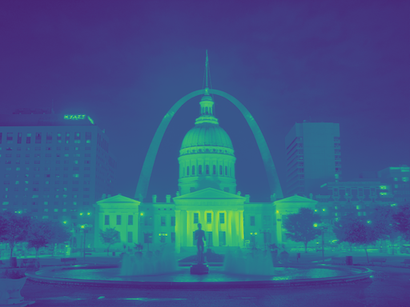   | 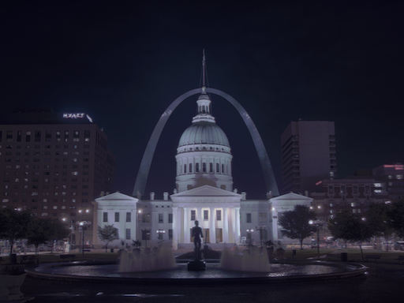   |
| 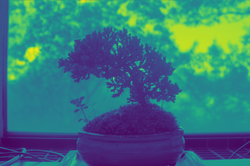 | 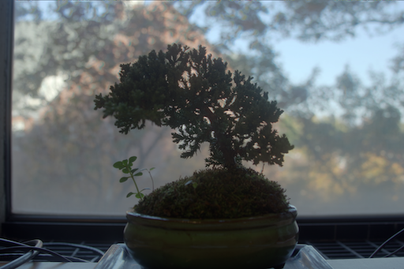 |
| 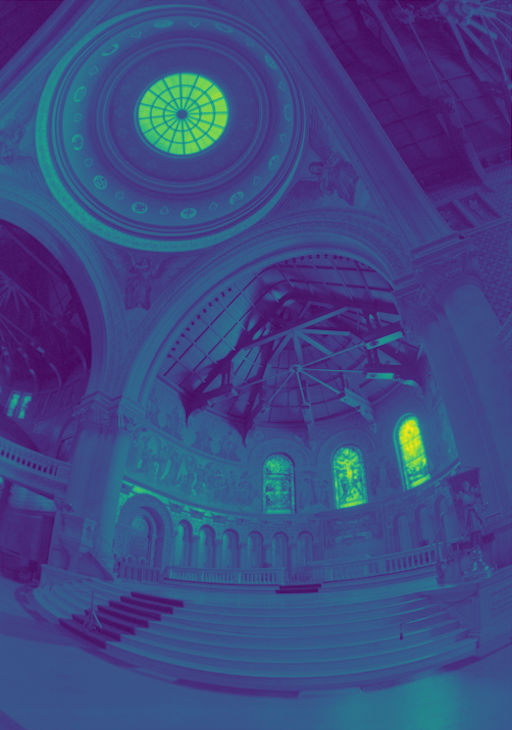 | 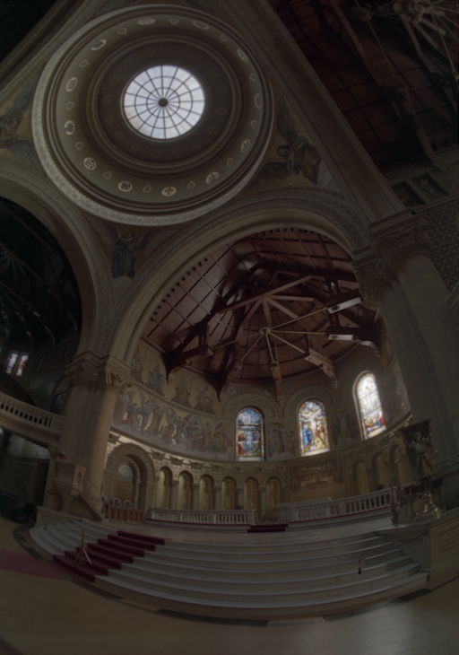 |
| 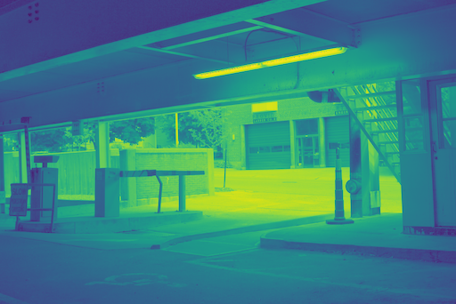 | 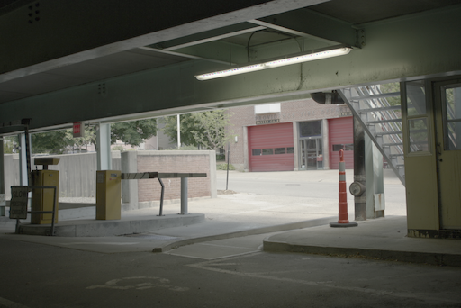 |
| 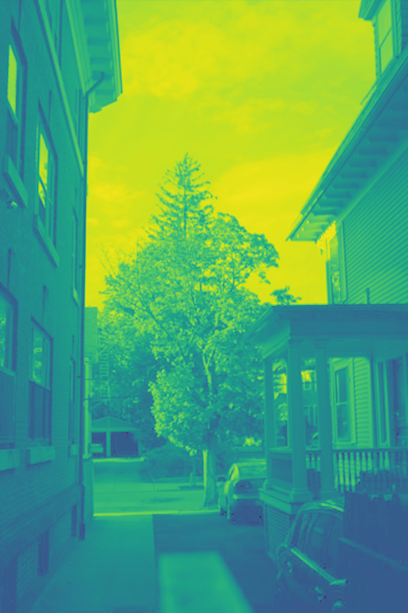  | 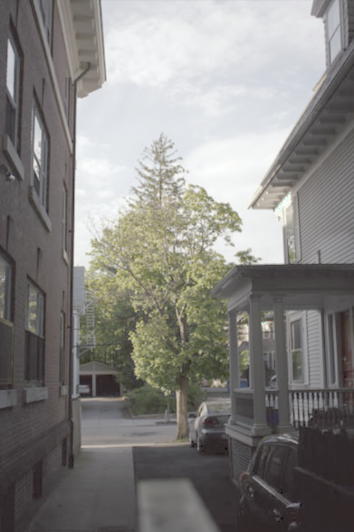  |
|     | 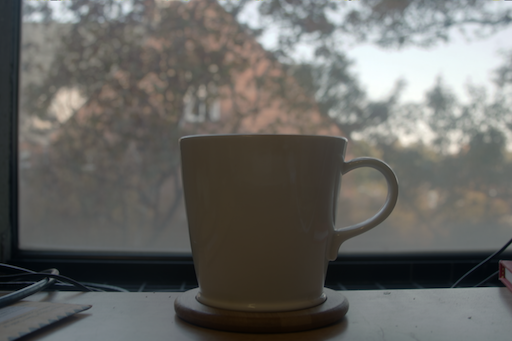    |
| 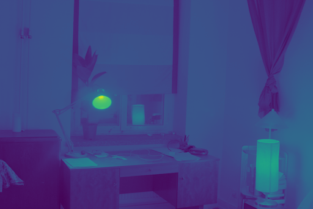 | 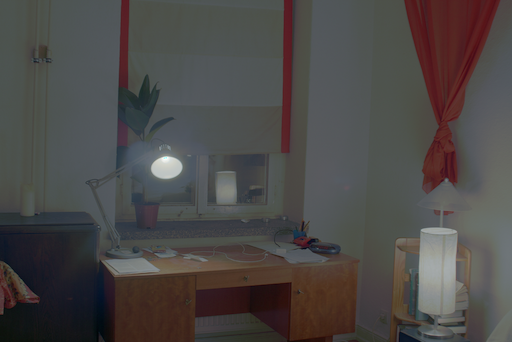 |

## Usage

All images should have names in the format of `'a_b'`, where the image is taken with a shutter speed of `a/b` seconds. e.g. `1_128.png` for an image with a 1/128s shutter speed. All images should have the same shape.

To run on a single image set:
```bash
python3 hdr.py path/to/data/dir
``` 

To run all image sets in `./data`:
```bash
python3 hdr.py
```

The script will generate two images for each set in `./output`. `{DIR_NAME}_radiance.png` is the estimated relative radiance map, and `{DIR_NAME}_bilateral.png` is the final HDR result.
